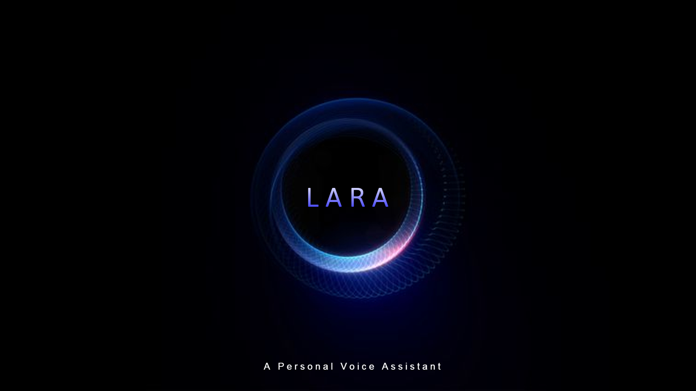

## Lara - Your Personal Assistant




Lara is a Python-based personal assistant designed to help you control your system operations using voice commands. Inspired by fictional AI assistants like Jarvis, Lara allows you to perform tasks such as managing processes, opening applications, and even searching YouTube

### Features
- **Voice Control:** Interact with Lara using voice commands. Simply say "Hey Lara" followed by your command to perform actions.
- **System Operations:** Execute tasks like killing processes or opening applications on your computer effortlessly.
- **YouTube Integration:** Search for videos on YouTube and open them directly from your assistant.
- **Modular Design:** Organized folder structure for easy expansion and maintenance.

### Installation
Clone the repository:
```bash
git clone https://github.com/sojanonelson/lara-assistant.git
cd lara-assistant
